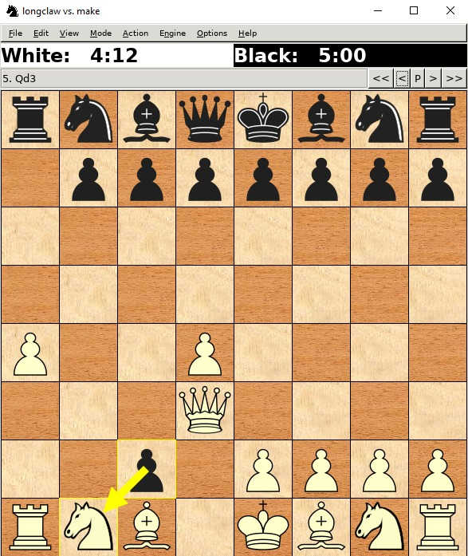
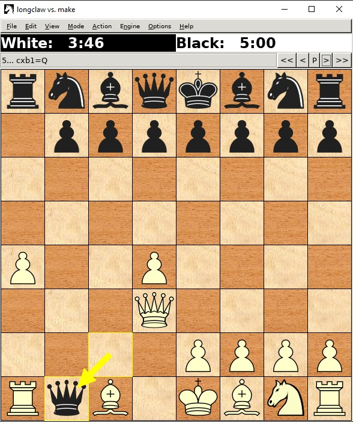

# Chess Engine

## Table of Contents

- [Chess Engine](#chess-engine)
  - [Table of Contents](#table-of-contents)
  - [Compiling Instructions](#compiling-instructions)
  - [Project Structure](#project-structure)
    - [Piece Namespace](#piece-namespace)
    - [Board Namespace](#board-namespace)
      - [initBoard() function](#initboard-function)
      - [makeMove() function](#makemove-function)
    - [Move Namespace](#move-namespace)
      - [initDistancesAndDirections() function](#initdistancesanddirections-function)
      - [generate() function](#generate-function)
    - [MoveGenerator Namespace](#movegenerator-namespace)
      - [checkForPromotionAndRandom() function](#checkforpromotionandrandom-function)
      - [generateMove() function](#generatemove-function)
  - [Algorithmic approach](#algorithmic-approach)
  - [Responsabilities](#responsabilities)
  - [Inspiration Sources](#inspiration-sources)
  - [Examples of running](#examples-of-running)

<br>

## Compiling Instructions

    make clean
    make build
    make run
    
    make run_ubuntu
    make debug_ubuntu
    make run_wsl
    make debug_wsl

<br>

## Project Structure

<br>

### Piece Namespace

The Piece Namespace contains the constants used for encoding each existing chess
piece. A piece is represented on 5 bits and the type of the piece can be found
by checking the last 3 bits of the encoding. A piece is white if the 4th bit is
set to 1 or black if the 5th bit is set to 1. The 4th and the 5th bits CANNOT be
set to 1 simultaneously.

Encoding:
Name | NONE | PAWN | ROOK | KNIGHT | BISHOP | QUEEN | KING
:---:|:----:|:----:|:----:|:------:|:------:|:-----:|:----:
<b>Encoding</b> | 0 | 1 | 2 | 3 | 4 | 5 | 6

<br>
Examples (the color of the piece = <span
style="color:green">green</span> | the type of the piece = <span
style="color:red">red</span>):

White Pawn &rarr; <span style="color:green">01</span><span
style="color:red">001</span>

Black Knight &rarr; <span style="color:green">10</span><span
style="color:red">011</span>

Name | Color | Type
:---:|:-----:|---:
White Pawn | <span style="color:green">01</span> | <span style="color:red">001</span>
Black Knight | <span style="color:green">10</span> | <span style="color:red">011</span>

<br>

### Board Namespace

Board Namespace is used to represent the chess table. It is formed from 63 squares.
For their representation, we use a static int pointer named “squares”.
“colorOnMove” variable is used to represent the color of the player that has to
move next. “botColor” variable represents the color of the bot (black/white).
"kingPos", "blackKingPos", "whiteKingPos" are variables used to store each king's
position.

#### initBoard() Function

The “initBoard()” function initializes the pieces on board, putting every piece on
its corresponding square (for example, the white queen is on the 5th square and
the black queen on 60th square). We use “getOpositeBotColor” to make a bitwise
xor with a mask of 11000, to change the current color to the oposite one. The
function “encodeMove” takes a pair of integers that represent a square’s location
and returns a string that represents a move on the table (example”a3a4”). As an
opposite to it, the function "decodeMove" recieves a move as a string that will be
decoded as an index to the corresponding square in the squares array. The
"makeMove" method takes a string as an argument (it represents a move) and makes
that move on the table. The "colorOnMove" variable will get the color of the
player that has to move. The move from parameter is decoded as a result and it
directly "moves" the piece.

#### makeMove() Function

This function is used to make a move and update the en passat move or the castle
move. First, the opposite bot color is set and the move is decoded. Then, the 
conditions for the en passant move are verified, in which case that move is applied.
After that, the conditions for castling are verified(the king and the rook haven't
been moved, the king is not in check). If these conditions are met, the castle is 
applied(either on the right side, or the left side). To prioritize the castle, the
"moves" array is emptied, and the only move left is the one that tells the bot to do
the castling.

<br>

### Move Namespace

Move Namespace represents a move on the table. It has an unoredered map that
represents directions a piece can make. It increments/decrements the number of
squares for a specified direction (example: to move one square up on the board,
you would have to add 8 to the current position).

#### initDistancesAndDirections() function

Function "initDistancesAndDirections" does exactly that: it initializes the
available directions for a piece and a distance for each one of them.

#### generatePawnCheckMoves() function

This function generates the attack moves of a pawn.

#### generateKnightMoves() function

Function "generateKnightMoves" checks where a knight piece can move and if it is
a valid position, it is added to the "result" vector using the "addMove" function.

#### generateKingMoves() function

Function "generateKingMoves" generates moves for a king piece. It also checks if a
castle can be made (the king and rook pieces haven't been moved and the there are no
pieces between them -> "emptyPath" function is used for the last part), in which case
the castle move is added to the result.

#### generateBishopMoves() function

Function "generateBishopMoves" checks where a bishop can be moved, or the longest distance
and adds the moves to the "result" vector.

#### generateRookMoves() function

This function has the same logic as "generateBishopMoves". It generates moves for a rook,
but the longest distance is calculated on a horizontal or vertical path.

#### checkForCastling() function

Function "checkForCastling" returns 1 if the move is actually a castling(it fulfills all 
conditions for a castling) or 0 otherwise. First, it verifies if the king is in check on
his position. Then it checks if the king has moved from its initial position. Then the 
function verifies if the king is in check after moving 2 positions.
If all these conditions are fulfilled, the bot can make a castle.

#### removePositionWithCheck() function

Function "removePositionWithCheck" simulates making the move on the board, checks if it
generates a situation where the king is in check. In that case, it removes the move from
the list of possible moves.

#### generate() function

Function "generate" generates random moves for a piece on the table. Depending on that
piece, it calls one of the above function(i.e. generateKinghtMoves).

<br>

### MoveGenerator Namespace

This namespace does what its name says: it acts as a generator for random moves.

#### CheckForPromotionAndRandom() function

Function "CheckForPromotionAndRandom" returns the padding for a promotion or an
empty string for a non-promotion. (a promotion means that if a pawn gets on the
final row on the table/ the first row of the opposite color, it is changed into
a better piece, randomly chosen).

#### generateMove() function

Function "generateMove" iterates through pieces and for the first piece that has
a valid move, it picks a random future position and makes that move. All the moves
are generated randomly.

<br>

### Logger Namespace

Ignore that.

<!-- <br> -->

<!-- ## Algorithms Details -->

<br>

## Algorithmic approach

--- FIRST STAGE ---

As for the algorithm used for the first stage, the program iterates through all pawns and, with each pawn, it tries to reach the end of the board so it can transform it into a queen. It priorities getting enemy pieces over moving forward.

--- SECOND STAGE ---

In this stage, the moves are randomly generated. However, the bot eliminates the moves that may put the king in check and tries to prevent the king from
reaching that stage. It also makes the castling a priority, which means that as soon as a castling move is available, it will be chosen. Also, the pawns
can make the en passant move (which is also prioritized). A pawn that reached the final row, can be promoted to a better piece, randomly chosen.

--- FiNAL STAGE ---

For the final stage we have implemented a negamax algorithm with alpha-beta pruning. The negamax algorithm starts with
the current board state and generates all the possible moves from this state. Next up, we iterate through all the 
possible moves, adn for each of them we artificially make that move and make another call to the negamax algorithm
with the specific parameters (adding +1 to the depth in the tree). On each call of negamax we check if we have reached
a leaf node in our tree, and in that case we make a call to the evaluation function (which we will get back to 
in just a second). The difference between negamax and a normal minimax is just an implementation difference, since we
have used the formula max(a,b) = -min(-a,-b) to reduce from 2 calls to the recursive (which would have been the case in
the minimax algorithm) to just 1 in negamax. We have implemented one more rule though, on each node in the tree
that we reach (on every call of the recursive function) we add a bonus to the evaluation if that specific state
in the tree generates a check (if the opponent generates a check will make it less likely for us to go down that
path in the tree, and if we give a check we add a considerable bonus on going down that path), this is the meaning
of the variable "check_bonus" that we have used.

For the evaluation function we made use of 2 heuristics: one is based on the material score and the other one on the
mobility score. The material score gives bonus points for the difference of pieces on the chess board (a move where we
take the opponent's queen is highly favorable for us, but a move where we lose a queen is highly unfavorable for us).
The other heuristic is the mobility score and forces pieces to certain position on the chess board, based on how 
valuable it is for that piece to be on that square (it is highly unfavorable for the king to be pushed up to the board,
so we will force it into our "home base" where he is more protected, same for pieces such as queens, rooks, bishops,
which are favored to be highly pushed onto the board so they can be more aggressive towards the enemy's side of the board).
The difference in our evaluation function from one made specifically for normal chess (we made one for 3 check chess
obviously) is that the pieces are much more aggressive and on every on every opportunity they have to give a check to the
opponent, they take it (A good offense if a strong defense :D). On the same note, our bot tries its hardest to avoid checks
and if it sees that in the further depths of the tree the opponent has the chance to give a check, it tries its best to
avoid that path and not let the opponent give a check to us.

## Responsabilities

For the first stage, we all worked together on developing the structure of the project and the logic behind it.

For the second stage, Mihai worked on the attack simulation part and the pawn promotions. 
Stefan worked on the generated moves for every piece and en-passant.
Vlad worked on the castling and the random-generated move.

For the final stage, Mihai has worked on the evaluation function and the heuristics it implies.
Stefan worked on the negamax algorithm, it's implementation and optimizations.
Vlad put together our algorithms and made it work with the previous code from the past stages.

## Inspiration Sources

https://youtu.be/U4ogK0MIzqk?t=59 &rarr; Chess piece encoding<br>
https://youtu.be/U4ogK0MIzqk?t=202 &rarr; Board representation<br>
https://www.chessprogramming.org/Evaluation &rarr; Evaluation function heuristics<br>
https://www.youtube.com/watch?v=l-hh51ncgDI &rarr; Minimax with alpha-beta pruning


<!-- <br> -->

<!-- ## Member's Responsabilities -->

<br>

## Examples of running

- For proving that the bot resigns once there is no pawn it can move we present
the following scenario :

The board is in the following state and the knight is about to capture the last black pawn |  After the capture we can see that the <strong>xboard</strong> received the <em>resign</em> command (black resigned)
:---:|:---:
  |  

- Showing that a pawn advancing in the final row can promote to a queen

The board is in the following state and the pawn is about to promote to a queen on b1 |  After the promotion we can see that the <strong>xboard</strong> promoted the pawn to a queen
:---:|:---:
  |  

The following code block will check if the pawn is in a correct position to be
promoted to a <strong>Queen</strong> and replaces the pawn on the table with
the actual value of the queen.

```cpp
if ((move >= 0 && move < 8 && (Board::botColor & Piece::BLACK)) || (move >= 56 && move < 64 && (Board::botColor & Piece::WHITE)))
        Board::squares[move] == Piece::QUEEN | Board::botColor;
```
