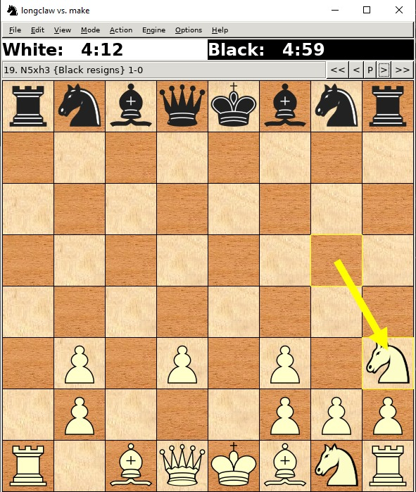

# <strong> Chess Engine </strong>

## <strong> Table of Contents </strong>

- [<strong> Chess Engine </strong>](#-chess-engine-)
  - [<strong> Table of Contents </strong>](#-table-of-contents-)
  - [  <strong> Compiling Instructions </strong>](#--compiling-instructions-)
  - [  <strong> Project Structure </strong>](#--project-structure-)
    - [  <strong> Piece Class </strong>](#--piece-class-)
    - [  <strong> Board Class </strong>](#--board-class-)
      - [<strong> initBoard() method </strong>](#-initboard-method-)
    - [  <strong> Move Class </strong>](#--move-class-)
      - [<strong> initDistancesAndDirections() method </strong>](#-initdistancesanddirections-method-)
      - [<strong> getFuturePostForMove() method </strong>](#-getfuturepostformove-method-)
    - [  <strong> GeneratePawnMoves Class </strong>](#--generatepawnmoves-class-)
  - [  <strong> Algorithms Details </strong>](#--algorithms-details-)
  - [  <strong> Inspiration Sources </strong>](#--inspiration-sources-)
  - [  <strong> Member's Responsabilities </strong>](#--members-responsabilities-)
  - [  <strong> Examples of running </strong>](#--examples-of-running-)
  
##   <strong> Compiling Instructions </strong>

    make clean
    make build
    make run

##   <strong> Project Structure </strong>

###   <strong> Piece Class </strong>

The Piece class contains the constants used for encoding each existing chess
piece. A piece is represented on 5 bits and the type of the piece can be found
by checking the last 3 bits of the encoding. A piece is white if the 4th bit is
set to 1 or black if the 5th bit is set to 1. The 4th and the 5th bits CANNOT be
set to 1 simultaneously.

Examples (the color of the piece = green | the type of the piece = red):

White Pawn &rarr; 01001

Black Knight &rarr; 10011

###   <strong> Board Class </strong>

Board Class is used to represent the chess table. It is formed from 63 squares.
For their representation, we use a static int pointer named “squares”.
“colorOnMove” variable is used to represent the color of the player that has to
move next. “botColor” variable represents the color of the bot (black/white).

#### <strong> initBoard() method </strong>

The “initBoard()” method initializes the pieces on board, putting every piece on
its corresponding square (for example, the white queen is on the 5th square and
the black queen on 60th square). We use “getOpositeBotColor” to make a bitwise
xor with a mask of 11000, to change the current color to the oposite one. The
methond “encodeMove” takes a pair of integers that represent a square’s location
and returns a string that represents a move on the table (example”a3a4”). As an
opposite to it, the method "decodeMove" recieves a move as a string that will be
decoded as an index to the corresponding square in the squares array. The
"makeMove" method takes a string as an argument (it represents a move) and makes
that move on the table. The "colorOnMove" variable will get the color of the
player that has to move. The move from parameter is decoded as a result and it
directly "moves" the piece.

###   <strong> Move Class </strong>

Move Class represents a move on the table. It has an unoredered map that
represents directions a piece can make. It increments/decrements the number of
squares for a specified direction (example: to move one square up on the board,
you would have to add 8 to the current position).

#### <strong> initDistancesAndDirections() method </strong>

Method "initDistancesAndDirections" does exactly that: it initializes the
available directions for a piece and a distance for each one of them. 

#### <strong> getFuturePostForMove() method </strong>

Method "getFuturePostForMove" returns the future position or a pair of <-1, -1>
coordinates if the move is invalid. A move can be invalid from 3 reasons: it is
out of the board, a piece of the same color is already in that place or moving
it puts the king in check. This method cannot be applied to the Knight, as it
moves in a different pattern and will have a dedicated method.
This class deals exactly with the specific rules for moving a pawn with separate
cases for white and black pawns.

###   <strong> GeneratePawnMoves Class </strong>

GeneratePawnMoves Class is used to do exactly what its name says: it generates possible
moves for the pawns.

##   <strong> Algorithms Details </strong>

##   <strong> Inspiration Sources </strong>

https://www.youtube.com/watch?v=U4ogK0MIzqk &rarr; Chess piece encoding and
board representation

##   <strong> Member's Responsabilities </strong>

##   <strong> Examples of running </strong>

For proving that the bot resigns once there is no pawn it can move we present
the following scenario :

1. The board is in the following state and the knight is about to capture the
last black pawn

2. After the capture we can see that the <strong>xboard</strong> received the <em>resign</em> command (black resigned)

