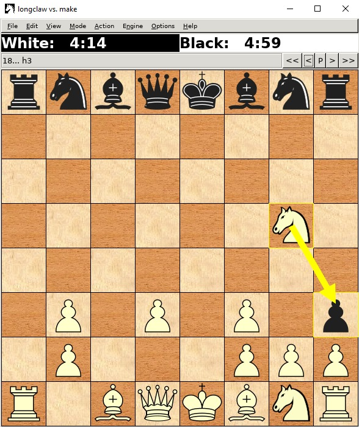

# Chess Engine

## Table of Contents

- [Chess Engine](#chess-engine)
  - [Table of Contents](#table-of-contents)
  - [Compiling Instructions](#compiling-instructions)
  - [Project Structure](#project-structure)
    - [Piece Class](#piece-class)
    - [Board Class](#board-class)
      - [initBoard() method](#initboard-method)
    - [Move Class](#move-class)
      - [initDistancesAndDirections() method](#initdistancesanddirections-method)
      - [getFuturePostForMove() method](#getfuturepostformove-method)
    - [GeneratePawnMoves Class](#generatepawnmoves-class)
  - [Inspiration Sources](#inspiration-sources)
  - [Examples of running](#examples-of-running)
  
<br>

## Compiling Instructions

    make clean
    make build
    make run

<br>

## Project Structure

<br>

### Piece Class

The Piece class contains the constants used for encoding each existing chess
piece. A piece is represented on 5 bits and the type of the piece can be found
by checking the last 3 bits of the encoding. A piece is white if the 4th bit is
set to 1 or black if the 5th bit is set to 1. The 4th and the 5th bits CANNOT be
set to 1 simultaneously.

Encoding:
Name | NONE | PAWN | ROOK | KNIGHT | BISHOP | QUEEN | KING
:---:|:----:|:----:|:----:|:------:|:------:|:-----:|:----: 
<b>Encoding</b> | 0 | 1 | 2 | 3 | 4 | 5 | 6 

<br>
Examples (the color of the piece = <span
style="color:green">green</span> | the type of the piece = <span
style="color:red">red</span>):

White Pawn &rarr; <span style="color:green">01</span><span
style="color:red">001</span>

Black Knight &rarr; <span style="color:green">10</span><span
style="color:red">011</span>

Name | Color | Type
:---:|:-----:|---:
White Pawn | <span style="color:green">01</span> | <span style="color:red">001</span>
Black Knight | <span style="color:green">10</span> | <span style="color:red">011</span>

<br>

### Board Class

Board Class is used to represent the chess table. It is formed from 63 squares.
For their representation, we use a static int pointer named “squares”.
“colorOnMove” variable is used to represent the color of the player that has to
move next. “botColor” variable represents the color of the bot (black/white).

#### initBoard() method

The “initBoard()” method initializes the pieces on board, putting every piece on
its corresponding square (for example, the white queen is on the 5th square and
the black queen on 60th square). We use “getOpositeBotColor” to make a bitwise
xor with a mask of 11000, to change the current color to the oposite one. The
methond “encodeMove” takes a pair of integers that represent a square’s location
and returns a string that represents a move on the table (example”a3a4”). As an
opposite to it, the method "decodeMove" recieves a move as a string that will be
decoded as an index to the corresponding square in the squares array. The
"makeMove" method takes a string as an argument (it represents a move) and makes
that move on the table. The "colorOnMove" variable will get the color of the
player that has to move. The move from parameter is decoded as a result and it
directly "moves" the piece.

<br>

### Move Class

Move Class represents a move on the table. It has an unoredered map that
represents directions a piece can make. It increments/decrements the number of
squares for a specified direction (example: to move one square up on the board,
you would have to add 8 to the current position).

#### initDistancesAndDirections() method

Method "initDistancesAndDirections" does exactly that: it initializes the
available directions for a piece and a distance for each one of them. 

#### getFuturePostForMove() method

Method "getFuturePostForMove" returns the future position or a pair of <-1, -1>
coordinates if the move is invalid. A move can be invalid from 3 reasons: it is
out of the board, a piece of the same color is already in that place or moving
it puts the king in check. This method cannot be applied to the Knight, as it
moves in a different pattern and will have a dedicated method.
This class deals exactly with the specific rules for moving a pawn with separate
cases for white and black pawns.

<br>

### GeneratePawnMoves Class

GeneratePawnMoves Class is used to do exactly what its name says: it generates
possible moves for the pawns.

The <strong> "getBlackLastPost" </strong> and <strong> "getWhiteLastPost"
</strong> gets the last position of the pawn, depending on its color.

To set the last position, we use the methods <strong> "setBlackLastPos"
</strong> and <strong>"setWhiteLastPos" </strong>, receiving a value as a
parameter.

The methods <strong>"getLastPosForCurrentColor" </strong> and
<strong>"setLastPosForCurrentColor"</strong> checks what color is the pawn and
gets/sets its last position.

The methods <strong>"getBlackCurrPawn"</strong> and
<strong>"getWhiteCurrPawn"</strong> return the value for the current pawn, black
or white.

Complementing them, we have the methods <strong> "setBlackCurrPawn" </strong>
and <strong>"setWhiteCurrPawn" </strong> that act as setters for the current
pawn, black or white.

<strong> "makeMoveUpdatePos" </strong> method returns the move that a pawn makes.
At the end, we update the last position with the method
"setLastPosForCurrentColor". We also check if the pawn is on the last row for
black or white, in which case it turns into a queen with the same color.

<strong> moveForNextPawn </strong> 

<!-- <br> -->

<!-- ## Algorithms Details -->

<br>

## Inspiration Sources

https://youtu.be/U4ogK0MIzqk?t=59 &rarr; Chess piece encoding<br>
https://youtu.be/U4ogK0MIzqk?t=202 &rarr; Board representation


<!-- <br> -->

<!-- ## Member's Responsabilities -->

<br>

## Examples of running

- For proving that the bot resigns once there is no pawn it can move we present
the following scenario :

The board is in the following state and the knight is about to capture the last black pawn |  After the capture we can see that the <strong>xboard</strong> received the <em>resign</em> command (black resigned)
:---:|:---:
  |  

- Showing that a pawn advancing in the final row can promote to a queen

The board is in the following state and the pawn is about to promote to a queen on b1 |  After the promotion we can see that the <strong>xboard</strong> promoted the pawn to a queen
:---:|:---:
  |  

The following code block will check if the pawn is in a correct position to be
promoted to a <strong>Queen</strong> and replaces the pawn on the table with
the actual value of the queen.

```cpp
if ((move >= 0 && move < 8 && (Board::botColor & Piece::BLACK)) || (move >= 56 && move < 64 && (Board::botColor & Piece::WHITE)))
        Board::squares[move] == Piece::QUEEN | Board::botColor;
```